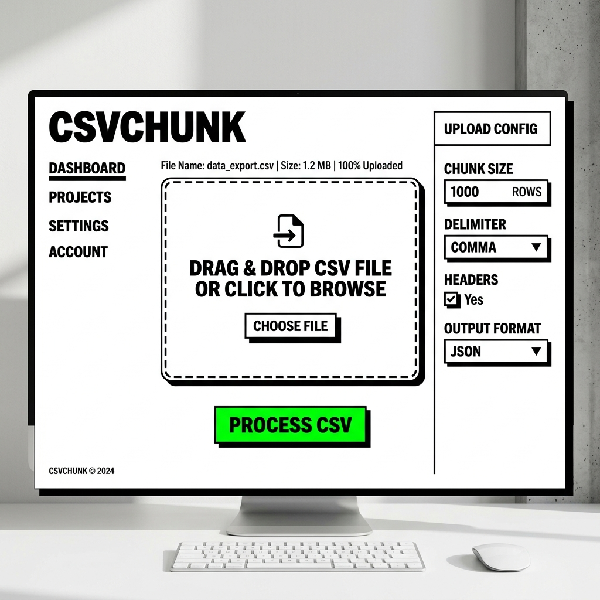
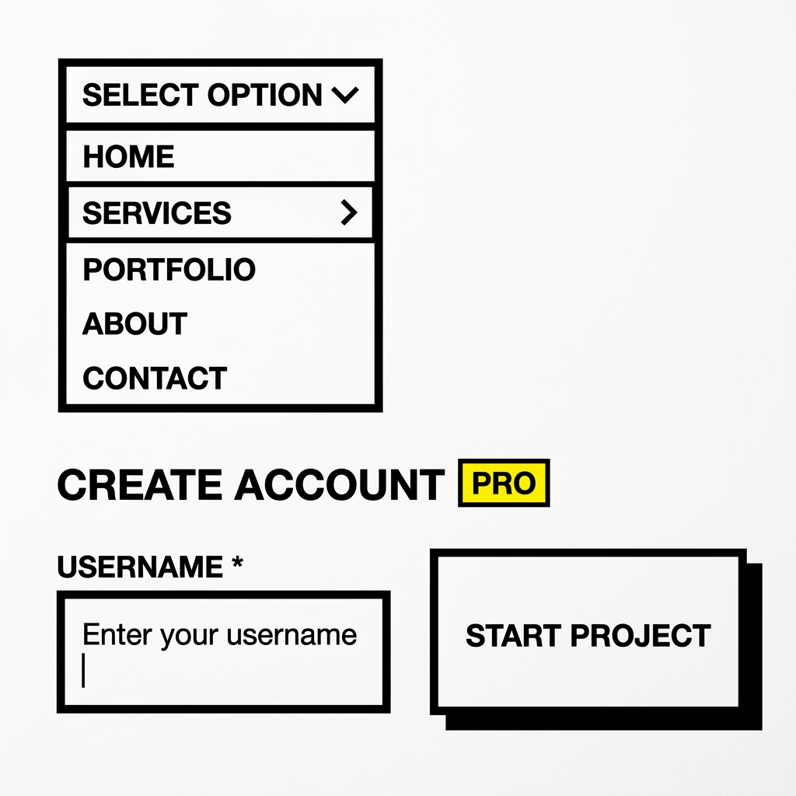

# Schultz Brutalist UI

> **Schultz Brutalist UI: An uncompromising, zero-dependency CSS framework for brutalist web design. Pure monochrome, sharp edges, hard shadows.**

This folder contains the core aesthetic rules and color palettes for the framework. The goal is a highly professional, clean, and uncompromising "Brutalist Monochrome" design inspired by extremely high-contrast, minimalist software architecture.

## 📸 Design Impressions
Here are two visual mockups illustrating the uncompromising black & white aesthetic we aim for:

### 1. Main Interface


### 2. UI Components & Details


---

## 🎨 Core Philosophy
1. **Ultra-Minimalist & Brutalist:** Pure black and white. No soft grays, no diffuse shadows. High contrast.
2. **Typography First:** Titles must always be fully capitalized (e.g., **CSVCHUNK**) and heavily weighted.
3. **Intentional Color:** Vibrant colors (Green, Red, Yellow) are reserved **strictly** for primary actions, warnings, or status states. Everything else is black or white.
4. **Tactile Feedback:** Because we lack gradients and roundness, interactive elements must respond aggressively to hover and focus states (e.g., solid color inversions or physical "push" animations).

---

## 🌈 Color Palette

### Monochrome Base
*   **Background (Body):** `#FFFFFF` (Pure white)
*   **Primary Text & Borders:** `#000000` (Pure black for maximum, uncompromising readability)
*   **Standard Buttons / Inputs:** Background `#FFFFFF`, Border `2px solid #000000`, Text `#000000`

### The Action Colors (Use Sparingly!)
*   **Primary Action (Green):** `#00C853` (A vibrant, punchy green)
*   **Warning / Highlight (Yellow):** `#FFD600` (PRO Badges, warnings)
*   **Danger / Error (Red):** `#FF3860` (Errors, delete actions)

---

## 💻 Component Library & Code Examples

Here is how you build the core elements in CSS/HTML. Copy and paste these to ensure absolute consistency across all your tools.

### 1. The "Brutalist Box" (Cards/Containers)
**Effect:** A stark, heavy container that leaps off the page without using soft, realistic shadows.
```css
.sbrutalist-box {
    background-color: #ffffff;
    color: #000000;
    border: 2px solid #000000;
    /* Hard, solid shadow instead of blur */
    box-shadow: 6px 6px 0px #000000;
    border-radius: 0;
    padding: 32px;
}
```

### 2. The Interactive Action Button (The "Push" Effect)
**Effect:** Green by default. Inverts to black on hover and physically "pushes down" by moving its position and erasing its shadow, simulating a real, heavy mechanical button.
```css
.sbrutalist-btn-primary {
    background-color: #00C853;
    color: #000000;
    font-weight: 900;
    font-size: 1.1rem;
    padding: 12px 24px;
    border: 2px solid #000000;
    border-radius: 0;
    text-transform: uppercase;
    letter-spacing: 1px;
    box-shadow: 4px 4px 0px #000000;
    cursor: pointer;
    transition: all 0.15s ease-out; /* Fast, snappy transition */
}

.sbrutalist-btn-primary:hover {
    background-color: #000000;
    color: #00C853;
    box-shadow: 0px 0px 0px #000000;
    transform: translate(4px, 4px); /* Pushes the button down mechanically */
}
```

### 3. Input Fields & Dropdowns (Forms)
**Effect:** Thick borders that demand attention. On hover, the background slightly darkens to give feedback. On focus, the border snaps to the brand's primary color (Green) to highlight active typing.
```css
.sbrutalist-input {
    width: 100%;
    padding: 10px;
    background-color: #ffffff;
    color: #000000;
    border: 2px solid #000000;
    border-radius: 0;
    font-weight: 700;
    font-family: inherit;
    transition: all 0.2s ease;
}

.sbrutalist-input:hover {
    background-color: #f0f0f0; /* Subtle feedback */
}

.sbrutalist-input:focus {
    border-color: #00C853; /* Active state highlights the primary color */
    outline: none; /* Remove browser default blue glow */
    background-color: #ffffff;
}
```

### 4. The Interactive Dropzone (File Upload)
**Effect:** A dashed area that completely inverts to a solid black block when hovered or when a file is dragged over it. This provides an unmistakable visual cue to the user.
```css
.sbrutalist-dropzone {
    border: 2px dashed #000000;
    background-color: #ffffff;
    color: #000000;
    padding: 40px;
    text-align: center;
    cursor: pointer;
    transition: all 0.2s ease;
}

.sbrutalist-dropzone:hover, .sbrutalist-dropzone.drag-active {
    background-color: #000000;
    color: #ffffff;
    border-style: solid; /* Switches from dashed to solid */
}
```

### 5. PRO Badges & Inline Tags
**Effect:** High contrast, small text with vertical alignment adjustments so it flows perfectly next to large headings.
```css
.pro-badge {
    background-color: #FFD600; /* Vibrant Yellow */
    color: #000000;
    padding: 2px 6px;
    border: 1px solid #000000;
    border-radius: 0;
    font-size: 0.7em;
    font-weight: 900;
    letter-spacing: 0.5px;
    vertical-align: super;
    margin-left: 8px;
}
```
*HTML Usage:* `<h2 class="title">Export to SQLite <span class="pro-badge">PRO</span></h2>`

### 6. Notifications & Error Alerts
**Effect:** Stark, high-visibility banners for system status. No gradients, just pure color and black text.
```css
.sbrutalist-alert-danger {
    background-color: #FF3860; /* Pure Red */
    color: #000000;
    border: 2px solid #000000;
    padding: 16px;
    font-weight: 700;
    box-shadow: 4px 4px 0px #000000;
}
```

### 7. Typography (Headings & Text)
**Effect:** Titles must look like heavy architecture. Body text remains legible but strong.
```css
.sbrutalist-h1 {
    font-size: 3rem;
    font-weight: 900;
    text-transform: uppercase;
    letter-spacing: 2px;
    color: #000000;
    margin-bottom: 0.5em;
}

.sbrutalist-label {
    font-weight: 800;
    font-size: 0.9rem;
    text-transform: uppercase;
    margin-bottom: 8px;
    display: block;
}
```

### 8. Responsive Grid Layouts
**Effect:** 2-column or 3-column layouts on desktop screens that automatically collapse into a single column on viewports under 768px.
```css
.sbrutalist-grid-2 {
    display: grid;
    grid-template-columns: repeat(2, 1fr);
    gap: 2rem;
    margin-bottom: 32px;
}

.sbrutalist-grid-3 {
    display: grid;
    grid-template-columns: repeat(3, 1fr);
    gap: 2rem;
    margin-bottom: 32px;
}

@media (max-width: 768px) {
    .sbrutalist-grid-2,
    .sbrutalist-grid-3 {
        grid-template-columns: 1fr;
    }
}
```

---

## 🚀 Quick Start / Project Setup

We have prepared a ready-to-use foundation in the `design/showroom/` folder so you can instantly bootstrap new projects without writing CSS from scratch.

### The Foundation Files
In the `design/showroom/` directory, you will find:
1. `sbrutalist.css` - The standalone CSS framework containing all styles. **Do not modify this unless you want to change the global brand.**
2. `index.html` - The interactive Showroom. Open this in your browser to see all elements live.
3. `template.html` - A completely clean, blank canvas boilerplate to start new projects.

### How to start a new project:
1. Copy `sbrutalist.css` into your new project's public folder.
2. Copy `template.html` and rename it to `index.html`.
3. Open your new `index.html` and start building! You now have full access to all `.sbrutalist-*` classes.

*Example of your blank canvas (`template.html`):*
```html
<!DOCTYPE html>
<html lang="en">
<head>
    <meta charset="UTF-8">
    <title>New App</title>
    <!-- Include the framework -->
    <link rel="stylesheet" href="sbrutalist.css">
</head>
<body>
    <div class="sbrutalist-container">
        <h1 class="sbrutalist-h1">NEW APP</h1>
        
        <div class="sbrutalist-box">
            <p class="sbrutalist-p">Start building here...</p>
            <button class="sbrutalist-btn-primary">ACTION</button>
        </div>
    </div>
</body>
</html>
```

---

## 🛠 Advanced Usage in Frameworks (React, Vue, Rust/Askama)

When migrating this CSS to a framework:
1. Import `sbrutalist.css` globally.
2. Ensure you completely disable any built-in framework defaults (like Bulma's soft shadows or rounded corners) by avoiding their classes. Stick exclusively to the `.sbrutalist-*` namespace.
